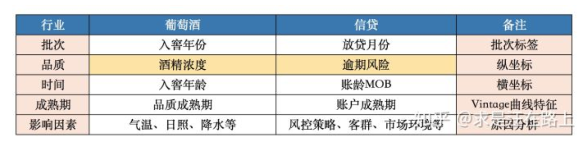
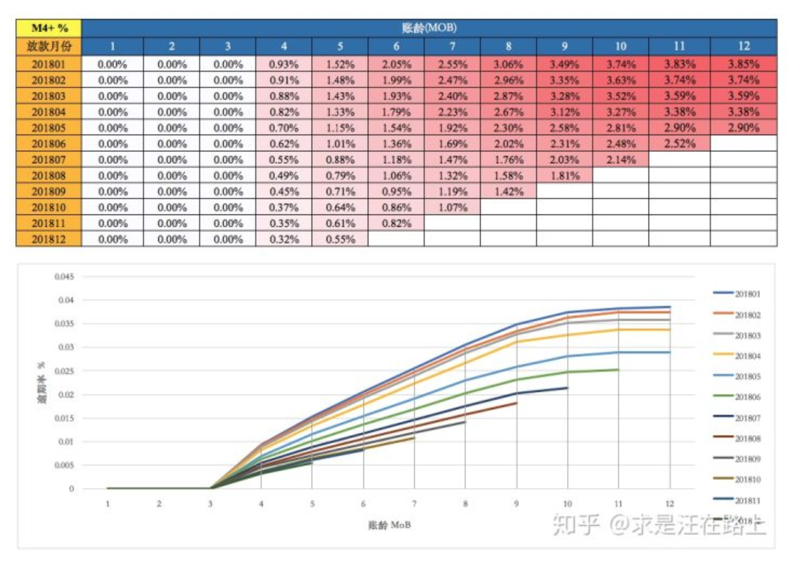
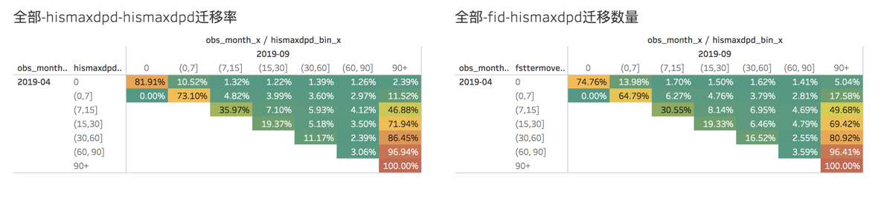

# 业务背景

信贷风险管理常常关注进行三个方面的资产分析.

- Vintage Analysis: 账龄分析, 可评估资产质量, 账户成熟期, 变化影响.
- Flow Rate Analysis: 迁移率, 可评估账户逾期程度确定好坏客户.

## 基础指标

> MOB(Month On Book)

和人的出生那天开始计算年龄一样, 贷款申请一旦放款, 这笔贷款就进入到了放款周期中, 这个周期叫Month On Book(**资产放款月份**). 

数值 | 含义与计算方法
:---:|:---:
MOB0 | 放款日至当月月底
MOB1 | 放款后第二个完整月份
MOB2 | 放款后第三个完整月份
...  | ...
MOB12 | 放款后第13个完整月份

MOB的最大值与信贷产品的还款期数有关, 如果是12期的放贷产品, 那么MOB最大为12. 

> DPD(Days Past Due)

**DPD指逾期天数**. 逾期天数 = 实际还款日 - 应还款日次日

比如: 某产品的因定还款日为每月8号, 一笔贷款自2019-11-04日放出, 12月实际还款日为2019-12-10日, 那么逾期1天. 

PPDN+ 表示逾期 >= N天, 比如PPD30+表示逾期天数 >= 30天.

> M(逾期期数, 取的是Month On Book的第一个单词)

逾期期数是指一笔放款连续逾期的月份数. 

**指实际还款日与应还款日次日之间逾期期数.** 

数值 | 含义与计算方法
:---: | :---:
MO | 当前未逾期(或用C表示, 取自Current)
M1 | 逾期1-30天
M2 | 逾期31-60天
M3 | 逾期61-90天
M4 | 逾期91-120天
M5 | 逾期121-150天
M6 | 逾期151-180天
M7 | 逾期180+(可能被销户)

## Vintate Analysis

账龄分析: 通过放款账龄观察客户的逾期情况, 即观察逾期率随着账龄增长的变化趋势. 通过账龄分析可得出几个方面的结论. 

- 确定资产质量: 产品逾期率, 一般指逾期趋势(曲线)稳定后的逾期率.
- 资产变化规律: 资产质量的变化情况, 如果前几期上升快, 说明短期风险未被捕获, 欺诈风险高; 如果曲线一直上升, 说明信用风险识别能力不佳. 
- 资产成熟期: 资产达到一定账龄后逾期率趋于稳定, 说明该账龄可以用以定义好坏客户的表现期. 
- 分析影响因素: 逾期率的变化可能受到风控政策收紧放宽, 监管政策的调节, 市场供需季度性变化, 客群质量等不同因素的影响, 分析影响原因可以用于指导风控政策的调整.

> 看一个图

- 产品期数: 12期
- 2018年5月放款的客户走完了12期还款周期, 而2018年6月放款的客户却没有, 说明数据统计时间是2019年6月初
- MOB1, MOB2, MOB3的逾期率都为0说明逾期期数>3, 即逾期天数90+也就是M4+.
- 从曲线上观察, 2018年5月逾期率曲线与2018年4月逾期率曲线间隔很大, 说明2018年5月资产质量明显好一些, 可能是风控策略提升了. 
- 2018年1月到12月放款客户的最终逾期率(沿着某个MOB看)都在下降, 说明**客群质量明显提升**, 有可能是风控水平在不断提升
- 不同放款月份的M4+都在9个MOB后趋于稳定, 说明产品质量的成熟期是9个月.

> 另外: 纵坐标成熟指标逾期率的定义有两种. 

- 订单口径: 逾期率=逾期订单数/总放款订单数
- 金额口径: 逾期率=逾期金额/总放款金额

> Flow Rate Analysis

迁移率是对一段时间的放款客户进行观察, 通过足够长的表现期后, 客户由某个逾期状态进一步逾期的情况. 

最清晰的观察期一般是一个月, 表现期则可视信贷产品周期选择. 如分6期的产品可以看4个MOB后的表现; 当然也可以通过vintage观察出成熟期后确定这里的表现期.下图是一个短期产品在2019年4月的放款, 观察期4个MOB后的逾期状态迁移情况.左侧为历史逾期天数, 右侧为首次逾期天数.

- 历史无逾期的客户, 82%依然保持不会逾期, 18%出现逾期情况
- 历史逾期(0,7]天的客户, 73%会还款, 27%进一步逾期
- 历史逾期(7,15]天的客户, 36%会还款, 65%进一步逾期
- 历史逾期(15, 30]天的客户, 19%会还款, 71%进一步逾期. 说明这个阶段的客户还款意愿已不再强烈.
- 历史逾期M1的客户, 11%会还款, 89%进一步逾期. 
- 历史逾期M2的客户, 3%会还款, 97%进一步逾期.

即: 2019年4月得到贷款的客户中, 逾期M1后, 只有11%的人会还款, 89%的人还款意愿不强烈; 甚至逾期M2后, 只有3%的客户可能被催收回来, 97%无还款意愿. 此时如果样本量足够, 可以将坏客户定义为Ever M2+@mob4.